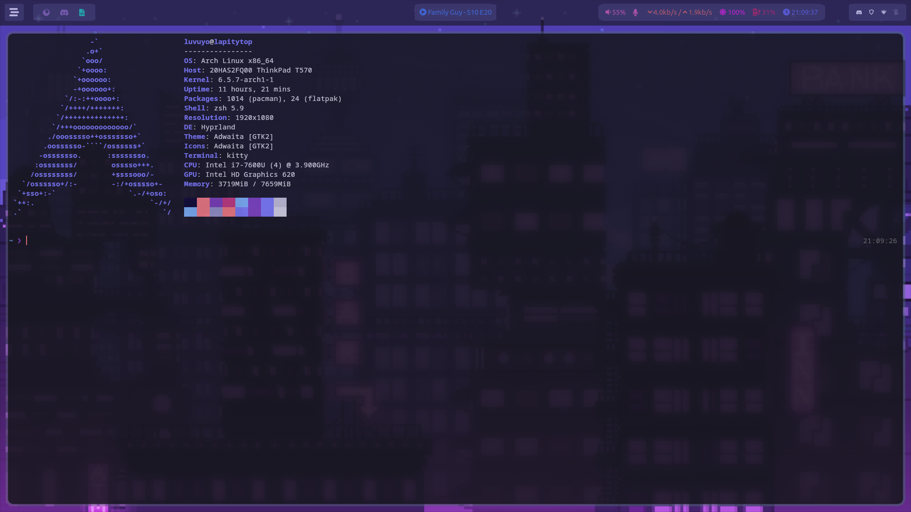
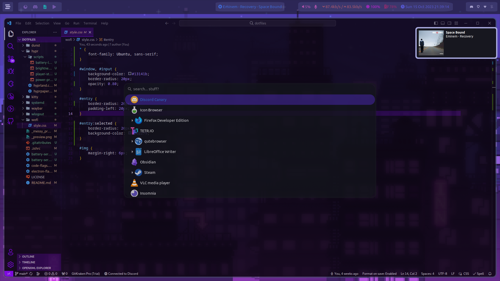

# spifory/dotfiles

My Linux configuration files.

## Things used

- Linux Distribution: [Arch Linux](https://archlinux.org)
- Desktop Environment/Window Manager: [Hyprland](https://hyprland.org/)
- App Launcher: [wofi](https://hg.sr.ht/~scoopta/wofi/)
- Task Bar: [Waybar](https://github.com/Alexays/Waybar/)
- Terminal: [kitty](https://sw.kovidgoyal.net/kitty/)
- Notifications: [dunst](https://dunst-project.org/)
- Clipboard Manager: [cliphist](https://github.com/sentriz/cliphist/)
- Screenshot Tool: [grimblast](https://github.com/hyprwm/contrib/)
- Logout Menu: [wlogout](https://github.com/ArtsyMacaw/wlogout)
